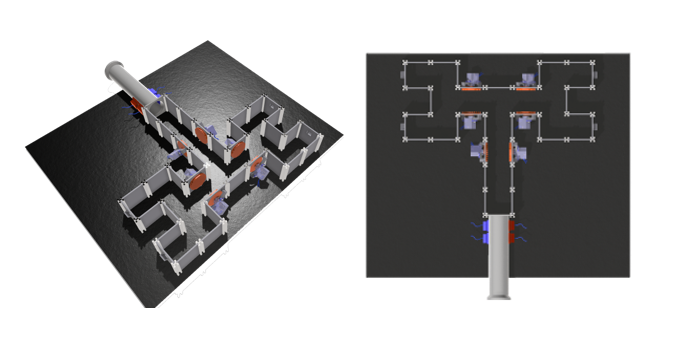

# The aMAZEing maze 

**A modular automated sensory engaging open-source platform for studying how sensory cues shape active exploration in rodents.**

[](LICENSE)
[](https://www.python.org/)
[](#testing)

---

## Table of Contents

- [The aMAZEing maze](#the-amazeing-maze)
  - [Table of Contents](#table-of-contents)
  - [Overview](#overview)
    - [Key Features](#key-features)
  - [System Requirements](#system-requirements)
  - [Installation](#installation)
  - [Usage](#usage)
    - [Running an Auditory Experiment](#running-an-auditory-experiment)
    - [Experiment Modes](#experiment-modes)
    - [Running the Tactile experiments](#running-the-tactile-experiments)
  - [Configuration](#configuration)
  - [Repository Structure](#repository-structure)
  - [Testing](#testing)
  - [Hardware Build](#hardware-build)
  - [Analysis Pipeline](#analysis-pipeline)
    - [Prerequisites](#prerequisites)
    - [Setup](#setup)
    - [Expected data layout](#expected-data-layout)
    - [Running the pipeline](#running-the-pipeline)
      - [Step 1: Choice accuracy across sessions](#step-1-choice-accuracy-across-sessions)
      - [Step 2: P1/P2 metrics and statistical models](#step-2-p1p2-metrics-and-statistical-models)
      - [Step 3: Transition probabilities](#step-3-transition-probabilities)
    - [Interpreting the outputs](#interpreting-the-outputs)
    - [Auditory Analysis Pipeline](#auditory-analysis-pipeline)
      - [1. Preference Analysis (`01_preference_analysis.py`)](#1-preference-analysis-01_preference_analysispy)
      - [2. Fiber Photometry Alignment (`fibpho_alignment.py`)](#2-fiber-photometry-alignment-fibpho_alignmentpy)
  - [Contributing](#contributing)
  - [Contributors](#contributors)
  - [License](#license)

---

## Overview

The aMAZEing Maze is a modular, reconfigurable maze system for behavioural neuroscience experiments. It combines real-time video tracking, auditory stimulus delivery, and optional hardware control (servos, TTL synchronisation for photometry) into a single Python-driven platform.

The system supports two main experimental paradigms:

| Paradigm | Description |
|---|---|
| **Auditory Maze** | Multi-arm maze with auditory stimuli (pure tones, musical intervals, temporal envelope modulation, tone sequences, vocalisations). Real-time ROI tracking triggers sound playback when the mouse enters specific arms. |
| **Tactile Maze** | 2-level binary decision tree with servo-controlled moveable grating walls and reward delivery system, for reward-based navigation studies. |

### Key Features

- **Real-time ROI tracking** via OpenCV binary thresholding with temporal debouncing
- **High-fidelity sound generation** at 192 kHz: sine, square, sawtooth, triangle, pulse, white noise
- **Speaker frequency-response compensation** from calibration CSV data
- **Musical interval system** using just-intonation ratios (consonant vs dissonant)
- **Temporal envelope modulation** (constant AM and complex multi-frequency AM)
- **Trial state machine** with 9-block silent/active alternation and unique-shuffle constraints
- **Arduino TTL synchronisation** for photometry alignment
- **MicroPython servo control** via PCA9685 PWM driver
- **Fully configurable** from a single dataclass (`ExperimentConfig`)

---

## System Requirements

- **Python** 3.10 or later
- **OS**: Windows 10/11 (tested), Linux/macOS (should work with minor path adjustments)
- **Hardware** (optional, for live experiments):
  - USB camera
  - a computer with at least 8GB RAM
  - Makerbeam posts
  - Bolts
  - Acrylic panel
  - Metal holding structure 
  You can find the dimensions [here](docs\dimensions.md) and the companies we sourced these materials from [here](docs\local_materials_company.md)
  - **For Auditory experiments:**
    - Audio interface capable of 192 kHz output (we use Focusrite)
    - Ultrasonic speaker (we use the [Vifa Ultrasonic dynamic speaker](https://avisoft.com/playback/vifa/)) in combination with a pre-amp (we use the [Portable Ultrasonic Power Amplifier](https://avisoft.com/playback/power-amplifier/)).
    - Arduino Uno/Nano (for TTL sync)
  - **For Tactile experiments**
    - Adafruit PCA9685 (for servo control)
    - BeeHive control board 
    - servos for sensory presentation and reward delivery 
    - 3D printer (see 3D printable gratings and reward delivery)


---

## Installation

```bash
# Clone the repository
git clone https://github.com/MaravallLab/aMAZEing-maze.git
cd aMAZEing-maze 

# Create a virtual environment (recommended)
python -m venv venv
source venv/bin/activate   # Linux/macOS
venv\Scripts\activate      # Windows

# Install dependencies
pip install -r requirements.txt

# For development (includes pytest)
pip install -r requirements-dev.txt
```

---

## Usage

### Running an Auditory Experiment

1. Edit `src/auditory/config.py` to set your experiment parameters (mode, sample rate, device IDs, paths).
2. Run the main script:

```bash
cd src/auditory
python main.py
```

3. The system will:
   - Prompt for mouse ID and create a session folder
   - Generate the trial structure based on your chosen experiment mode
   - Calibrate the background (step away from the camera)
   - Run the experiment loop: track the mouse, play sounds on ROI entry, log visits
   - Save trial data (CSV + NPY) after every trial

### Experiment Modes

Set `experiment_mode` in `config.py` to one of:

| Mode | Description |
|---|---|
| `simple_smooth` | One pure tone per ROI arm |
| `simple_intervals` | Two-tone chords (musical intervals) per ROI |
| `temporal_envelope_modulation` | Smooth, constant-AM, and complex-AM sounds |
| `complex_intervals` | Multi-day interval protocol with consonant/dissonant contrasts |
| `sequences` | Tone-pattern sequences (ABAB, AoAo, etc.) |
| `vocalisation` | Each ROI plays a different vocalisation recording |

### Running the Tactile experiments

```bash
cd src/simplermaze
python simplerCode.py
```

This runs the tactile paradigm with servo-controlled gratings walls and automated reward delivery.

---

## Configuration

All experiment parameters are defined in a single dataclass:

```python
# src/auditory/config.py
@dataclass
class ExperimentConfig:
    samplerate: int = 192000
    channel_id: int = 3
    default_sound_duration: float = 10.0
    default_waveform: str = "sine"
    experiment_mode: str = "complex_intervals"
    complex_interval_day: str = "w1day3"
    # ... see config.py for all options
```

Key settings to adjust for your setup:
- `channel_id` -- your audio output device index
- `arduino_port` -- COM port for the Arduino (e.g. `"COM4"`)
- `video_input` -- camera device index
- `base_output_path` -- where session data is saved (defaults to `~/Desktop/auditory_maze_experiments/maze_recordings`)

---

## Repository Structure

```
aMAZEing-maze/
├── src/
│   ├── auditory/               # Auditory maze experiment
│   │   ├── config.py           #   Experiment configuration dataclass
│   │   ├── main.py             #   Main experiment loop
│   │   └── modules/
│   │       ├── audio.py        #   Sound generation & playback
│   │       ├── experiments.py  #   Trial structure factory
│   │       ├── vision.py       #   ROI tracking (OpenCV)
│   │       ├── data_manager.py #   Session & visit logging
│   │       └── hardware.py     #   Arduino/camera control
│   └── simplermaze/            # Tactile maze with servos
│       ├── simplerCode.py      #   Main script
│       └── supFun.py           #   Support functions
│
├── firmware/
│   ├── ttl_bnc/                # Arduino TTL synchronisation sketch
│   ├── arduino/                # Servo control sketches
│   └── micropython/            # Pico PCA9685 servo driver
│
├── analysis/
│   ├── auditory/               # Auditory experiment analysis notebooks
│   ├── simplermaze/            # Tactile experiment analysis & DLC pipeline
│   │   ├── first_paper_exploratory_analysis/
│   │   └── trials_segmentation/
│   └── calibration/            # Speaker frequency-response calibration
│
├── hardware/
│   ├── 3dmodels/               # FreeCAD & STL files for maze parts
│   ├── drawings/               # Schematics and task design diagrams
│   └── photos/                 # Construction photos
│
├── archive/                    # Legacy code (preserved for reference)
│   ├── auditory_v1/            #   Original monolithic auditory script
│   ├── abandoned/              #   Abandoned experimental approaches
│   └── legacy/                 #   Bonsai workflow & old segmentation
│
├── docs/                       # Sphinx documentation source
├── tests/                      # pytest test suite (63 tests)
├── requirements.txt
├── requirements-dev.txt
└── LICENSE                     # GPLv3
```

---

## Testing

The test suite covers audio generation, trial structure, ROI tracking, data management, configuration, and integration scenarios. All hardware dependencies are mocked.

```bash
# Run all tests
python -m pytest tests/ -v

# Run with coverage
python -m pytest tests/ --cov=src/auditory/modules --cov-report=term-missing

# Run a specific test file
python -m pytest tests/test_audio.py -v
```

---

## Hardware Build

The maze is built from laser-cut acrylic and 3D-printed components. All CAD files are in `hardware/3dmodels/`.

Key components:
- **Maze base plate** with reconfigurable arm slots
- **Moveable walls** with servo-driven cog mechanism
- **Camera holder** mounted above the maze
- **Electronics enclosure** for Arduino and driver boards
- **Reward delivery chute** with servo-actuated gate

See `hardware/drawings/` for schematics and `hardware/photos/` for assembly reference.



---

## Analysis Pipeline

The Tactile maze behavioural analysis pipeline lives in `analysis/simplermaze/first_paper_exploratory_analysis/`. It processes DeepLabCut (or SLEAP) pose-estimation data alongside trial CSVs to produce publication-ready figures and statistics.

### Prerequisites

In addition to `requirements.txt`, the analysis pipeline needs:

```bash
pip install rpy2          # optional: for GLMM via R's lme4
pip install statsmodels   # already in requirements.txt
```

If using the GLMM features, you also need R installed with the `lme4` package:

```r
install.packages("lme4")
```

### Setup

Edit `analysis/simplermaze/first_paper_exploratory_analysis/config.py`:

```python
MOUSE_ID = "6357"
BASE_PATH = os.path.join(
    os.path.expanduser("~"), "Box", "Awake Project", "Maze data", "simplermaze"
)
```

The pipeline auto-discovers all sessions for the mouse. Verify with:

```bash
cd analysis/simplermaze/first_paper_exploratory_analysis
python config.py
```

This prints every detected session, whether it has DLC tracking data, and which trial CSV it found.

### Expected data layout

```
<BASE_PATH>/mouse <MOUSE_ID>/
├── habituation/
│   ├── mouse<ID>_session1.1_trial_info.csv
│   └── rois1.csv
├── <timestamp><ID>session<X.Y>/          # e.g. 2024-08-29_10_23_026357session3.7
│   ├── new_session<X.Y>_trials.csv       # or clean_mouse<ID>_session<X.Y>_trial_info.csv
│   └── rois1.csv
└── deeplabcut/                           # DLC tracking (only some sessions)
    └── .../<ID>_<timestamp>s<X.Y>DLC_*.csv
```

**Trial CSV columns used:**

| Column | Description |
|---|---|
| `rew_location` | Correct arm letter (A/B/C/D) |
| `first_reward_area_visited` | ROI the mouse visited first (e.g. `rewB`) |
| `rewA`, `rewB`, `rewC`, `rewD` | Time spent in each arm (ms), empty if not visited |
| `hit`, `miss`, `incorrect` | Original classifications (may have misdetections) |
| `start_trial_frame`, `end_trial_frame` | Frame boundaries for DLC alignment |

### Running the pipeline

All scripts are run from the `first_paper_exploratory_analysis/` directory.

#### Step 1: Choice accuracy across sessions

```bash
python 01_choice_accuracy.py
```

**What it does:** Loads trial CSVs from all sessions (habituation through 3.8). Recomputes trial outcomes from `first_reward_area_visited[-1] == rew_location` as a sanity check against the `hit`/`miss`/`incorrect` columns. Excludes trials where the mouse never entered any reward arm. Fits a binomial GLMM (`correct ~ session + (1|mouse_id)`) to test whether choice accuracy changes across sessions.

**Outputs** (saved to `mouse <ID>/MOUSE_<ID>_TOTAL_ANALYSIS/`):

| File | Description |
|---|---|
| `choice_accuracy_across_sessions.png/.pdf` | Grouped bar chart: correct / incorrect / no-choice per session |
| `choice_accuracy_summary.csv` | Per-session counts and percentage correct |
| Terminal | GLMM coefficients and p-values |

#### Step 2: P1/P2 metrics and statistical models

```bash
python 02_metrics_and_models.py
```

**What it does:** For sessions with DLC data (3.6, 3.7, 3.8), splits each trial into Phase 1 (maze entry to first ROI reached) and Phase 2 (ROI to trial end). Computes per-phase duration, mean speed (cm/s, Savitzky-Golay smoothed), and spatial entropy. Runs three statistical tests comparing Hit vs Miss: Mann-Whitney U, Linear Mixed Model (statsmodels), and Gamma GLMM (rpy2/lme4) for the positively-skewed speed and duration data.

**Outputs:**

| File | Description |
|---|---|
| `master_behavioural_data.csv` | Per-trial metrics: session, status, P1/P2 duration, speed, entropy |
| `violin_plots.png/.pdf` | 2x3 grid of violin plots (P1/P2 x duration/speed/entropy) with MWU and LMM p-values |
| `stats_report.csv` | All p-values in one table (MWU, LMM, Gamma GLMM) |
| Terminal | Gamma GLMM summaries from R |

#### Step 3: Transition probabilities

```bash
python 03_transition_probabilities.py
```

**What it does:** For sessions with DLC data, assigns each frame to an ROI (entrance1/2, rewA-D) or "corridor" using bounding-box checks. Collapses consecutive identical states to extract the sequence of compartment transitions. Builds per-trial transition matrices, aggregates separately for Hit and Miss trials, and computes derived metrics: perseveration rate (how often the mouse returns to the same arm), exploration entropy (how evenly it visits different arms), and number of unique ROIs visited.

**Outputs:**

| File | Description |
|---|---|
| `transition_combined.png/.pdf` | Side-by-side heatmaps: Hit transitions, Miss transitions, difference (Hit - Miss) |
| `exploration_metrics.png/.pdf` | Violin plots comparing perseveration, exploration entropy, and unique ROIs (Hit vs Miss) |
| `transition_summary.csv` | Per-trial: state sequence, perseveration rate, exploration entropy, unique ROIs |

### Interpreting the outputs

**Choice accuracy plot:** A learning curve. If the bars shift from mostly red (incorrect) to mostly green (correct) across sessions, the mouse is learning the task. The GLMM p-value for the session coefficient tells you whether this trend is statistically significant.

**Violin plots:** Each panel shows the distribution of a metric for Hit vs Miss trials. Key comparisons:
- P1 speed: do mice run faster on trials where they find the reward?
- P1 entropy: do successful trials show more directed (lower entropy) trajectories?
- P2 duration: do mice spend more time in the reward zone on Hit trials?

**Transition heatmaps:** Read row-by-row: "given the mouse is in row-ROI, what is the probability it goes to column-ROI next?" The difference map highlights where Hit and Miss trials diverge -- e.g., Hit trials may show stronger corridor-to-correct-arm transitions.

**Exploration metrics:** Perseveration rate > 0 means the mouse tends to revisit the same arm after leaving it. Higher exploration entropy means more uniform visiting across arms.

### Auditory Analysis Pipeline

Two independent analysis scripts live under `analysis/auditory/`:

#### 1. Preference Analysis (`01_preference_analysis.py`)

Batch computes preference index (PI) and sensory complexity effects across all mice and experiment days in the 8-arm auditory maze.

**Prerequisites:**

```bash
pip install numpy pandas matplotlib seaborn scipy statsmodels
```

**Expected data layout:**

```
8_arms_w_voc/
  w1_d1/                            # Day 1: temporal envelope modulation
    time_2025-06-04_14_22_30mouse10049/
      trials_time_2025-06-04_14_22_30.csv
    ...
  w1_d2/                            # Day 2: consonant/dissonant intervals
  w1_d3/                            # Day 3: consonant/dissonant intervals
  w1_d4/                            # Day 4: intervals (no silent control)
  w2_sequences/                     # Week 2: tone sequences
  w2_vocalisations/                 # Week 2: mouse vocalisations
```

**Configuration:**

Edit `preference_analysis_config.py`:
- `BASE_PATH` -- root folder containing `w1_d1/`, `w1_d2/`, etc.
- Or set the `MAZE_DATA_DIR` environment variable to override.

**Running:**

```bash
cd analysis/auditory
# Verify session discovery first:
python preference_analysis_config.py

# Run the full analysis:
python 01_preference_analysis.py
```

**Outputs** (saved to `BATCH_ANALYSIS/` inside the data folder):

| File | Description |
|------|-------------|
| `preference_data.csv` | Per-mouse, per-session PI + visit metrics |
| `stimulus_breakdown.csv` | Per-stimulus-type visit duration |
| `fig1_pi_trajectories.png/pdf` | Individual mouse PI trajectories across days |
| `fig2_pi_by_day.png/pdf` | Mean PI per day with 95% CI |
| `fig3_pi_violins.png/pdf` | Violin plots of PI distribution by day |
| `fig4_complexity_heatmap.png/pdf` | Visit duration by stimulus type per day |
| `fig5_vocalisation_contrast.png/pdf` | Paired comparison: vocalisation vs other days |
| `fig6_re_vs_pi.png/pdf` | Roaming entropy vs preference (within & between mouse) |
| `fig7_icc_summary.png/pdf` | Variance decomposition (ICC) + Kruskal-Wallis |
| `stats_report.txt` | All statistical test results |

**Key analyses:**

- **Preference Index (PI):** `(Avg_Sound_Duration - Avg_Silent_Duration) / (Avg_Sound_Duration + Avg_Silent_Duration)`. Ranges from -1 (prefer silence) to +1 (prefer sound).
- **Sensory complexity:** Within each day, stimulus types are ordered by complexity (e.g., smooth < constant_rough < complex_rough for TEM day) and visit durations compared via Kruskal-Wallis.
- **Vocalisation contrast:** Paired Wilcoxon signed-rank comparing each mouse's vocalisation-day PI vs their mean PI on other days.
- **Mixed-effects models:** (1) Unconditional `PI ~ 1 + (1|mouse)` for ICC decomposition, (2) `PI ~ day + (1|mouse)` to test if vocalisation day differs, (3) `PI ~ RE_within + RE_between + (1|mouse)` to test if exploration predicts preference.
- **Roaming entropy (RE):** Shannon entropy of time proportions across ROIs during habituation, normalised to [0, 1].

#### 2. Fiber Photometry Alignment (`fibpho_alignment.py`)

Aligns Tucker-Davis Technologies (TDT) fiber photometry recordings with auditory maze visit CSV timestamps using TTL pulse matching.

**Prerequisites:**

```bash
pip install numpy pandas matplotlib scipy tdt
```

**Configuration:**

Edit paths at the top of `fibpho_alignment.py`:
- `TANK_PATH` -- path to the TDT tank folder (contains `.Tbk`, `.Tdx`, `.tev`, `.tsq` files)
- `VISIT_CSV` -- path to the `mouseXXXXX_vocalisations_detailed_visits.csv`
- `TRIALS_CSV` -- path to the `trials_time_YYYY-MM-DD_HH_MM_SS.csv`

**Running:**

```bash
cd analysis/auditory
python fibpho_alignment.py
```

**Outputs** (saved to `fibpho_analysis/` inside the session folder):

| File | Description |
|------|-------------|
| `alignment_report.csv` | Event-by-event TTL-to-CSV mapping with residuals |
| `fibpho_aligned_overview.png/pdf` | Full-session dF/F with colour-coded TTLs |
| `fibpho_trial_panels.png/pdf` | Per-trial zoomed dF/F panels |
| `fibpho_peri_event.png/pdf` | Peri-event average dF/F by vocalisation type |
| `fibpho_peri_event_pooled.png/pdf` | Pooled peri-event dF/F (all stimuli) |

**How alignment works:**

1. The TDT recording starts before the maze experiment (different clocks)
2. The script reads TTL onset times from the TDT `MTL_` epoc store
3. It matches inter-event intervals to `sound_on_time` entries in the visit CSV
4. The first TTL is identified as a test pulse and excluded
5. A precise clock offset is computed (typical alignment: <70ms residual)
6. Delta F/F is calculated using 405nm isosbestic correction of the 465nm GCaMP signal

---

## Contributing

Contributions are welcome! To get started:

1. Fork the repository
2. Create a feature branch (`git checkout -b feature/my-feature`)
3. Make your changes and ensure tests pass (`python -m pytest tests/ -v`)
4. Commit and push
5. Open a pull request

Please keep the test suite green and add tests for new functionality.

---

## Contributors


- Miguel Maravall
- Alejandra Carriero
- Shahd Al Balushi
- Andre Maia Chagas
- Isobel Parkes
- Oluwaseyi Jesusanmi
- Isabel Maranhao
- Maja Nowak
- Marcus Burnell-Spector
- Yuri Elias Rodrigues
  


---

## License

This project is licensed under the [GNU General Public License v3.0](LICENSE).
