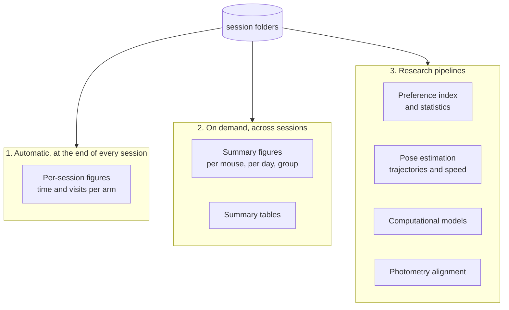

# Analysis overview

Analysis happens in three places, and it helps to know which one you are in.

**Automatic figures** are generated when a session ends and land in the session folder. They tell you whether the session worked, not what it means. Look at them the same day.

**Cross-session summaries** pool mice and days. These are the first figures that say anything about a result. Run them from the Analysis tab or with `amaze-summary`.

**The research pipelines** are the scripts under `analysis/` used for the published work: the preference index and its statistics, pose estimation for trajectories, the aesthetic value model, and photometry alignment. They are standalone scripts rather than part of the package, and they expect a data folder rather than a single session.

## Which pipeline

| You want | Go to |
|---|---|
| To check a session ran correctly | [What a session saves](../guide/outputs.md) |
| A first look at a set of sessions | [Tutorial: analyse a set of sessions](tutorial.md) |
| Preference index, statistics, modelling for the auditory maze | [Auditory pipeline](auditory.md) |
| Choice accuracy and trajectories for the tactile maze | [Tactile pipeline](tactile.md) |
| Keypoints and trajectories from video | [Pose estimation pipeline](pose.md) |

## A note on units

The first version of this software recorded `time_spent` in the trials table in **milliseconds**. The current version records **seconds**. Every session folder now contains a `session_manifest.json` that states the units of each column, and analysis code should read it rather than assume.

The auditory preference pipeline also works around a recording fault in the older data, where visits that spanned the end of a block were not closed and their durations inflated. It prefers the per-visit log over the aggregate table and applies sanity caps. That fault is fixed in the current software, so new recordings do not need the workaround, but the loader still applies it because it is harmless on clean data.
