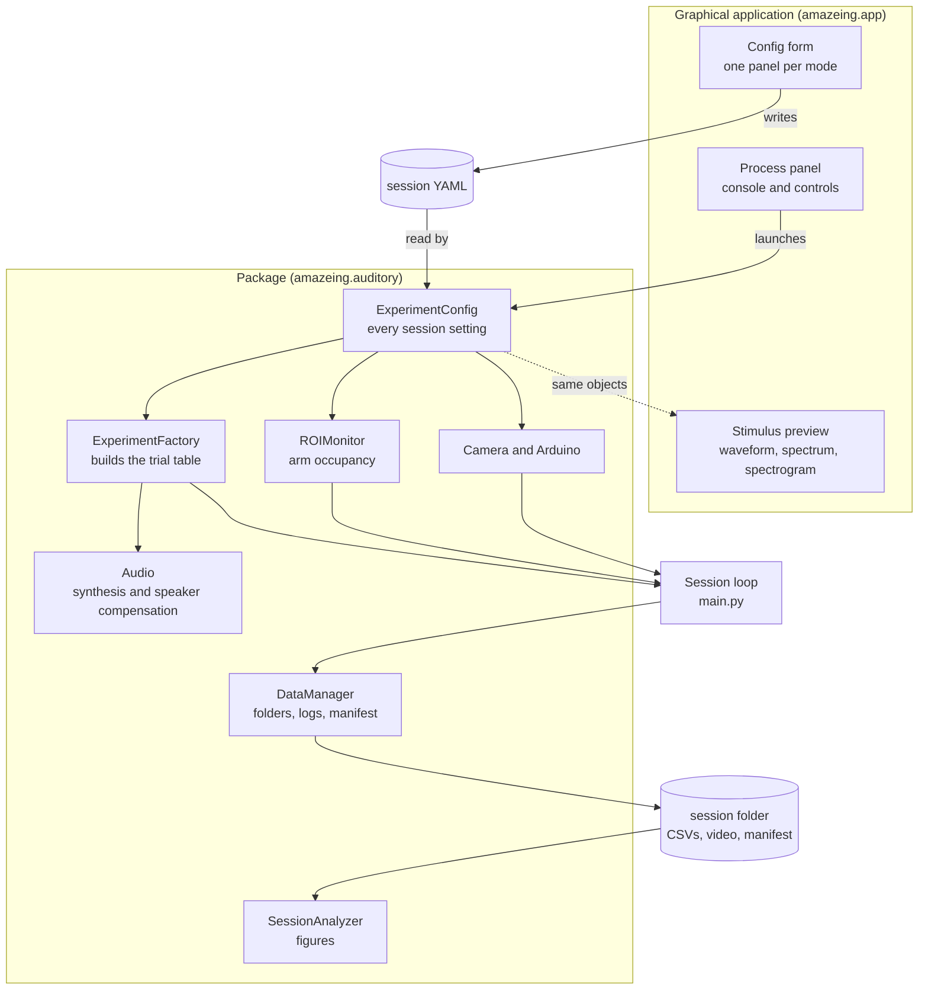
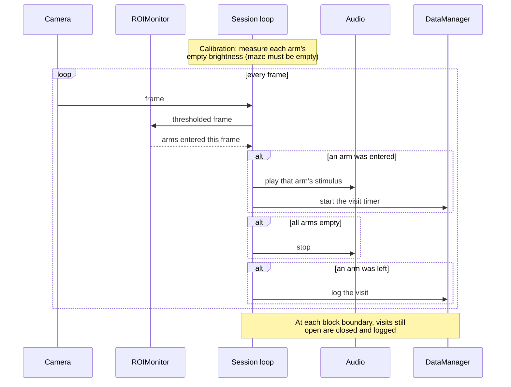
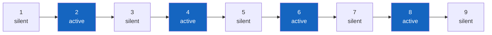
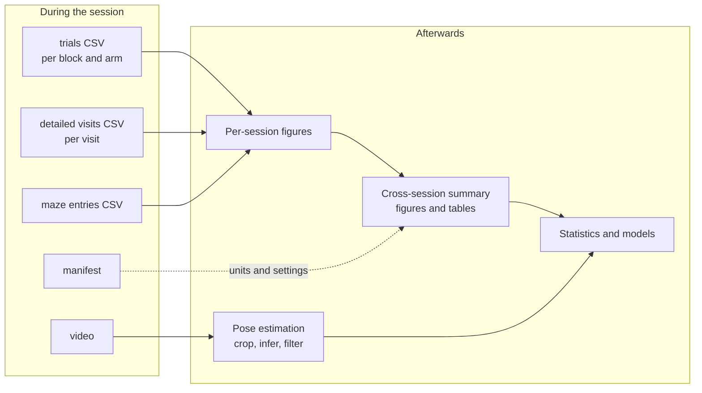

# Architecture

## The shape of the system

The application never runs an experiment in its own process. It writes a configuration file and launches the same command-line entry point a terminal user would, then shows that process's output. This is why a session started from the window and one started from a terminal are identical, and why the interface cannot introduce a behaviour the scripts do not have.

## The session loop

## The nine-block cycle

Every mode uses the same structure. Odd positions are silent, even positions are active, and the stimulus-to-arm mapping is reshuffled at the start of each active block.

The reshuffle is the load-bearing part of the design. If an animal returns to the same physical arm regardless of what plays there, that is a place preference. If it follows a stimulus as the stimulus moves between arms, that is a sound preference. Without the reshuffle the two are indistinguishable.

Because each active block needs a mapping that has not been used yet, and there are only as many mappings as there are orderings of the arms, a maze with fewer than three arms cannot supply four distinct mappings. The search gives up after a bounded number of attempts and reuses one rather than looping forever.

## Data flow through an experiment

## Package layout

| Module | Responsibility |
|---|---|
| `amazeing.auditory.config` | `ExperimentConfig`: every setting, the block schedule, the per-mode stimulus parameters |
| `amazeing.auditory.session_config` | Reading and writing that config as YAML |
| `amazeing.auditory.experiments` | `ExperimentFactory`: turns a config into a trial table plus waveforms |
| `amazeing.auditory.audio` | Synthesis, speaker compensation, playback |
| `amazeing.auditory.vision` | `ROIMonitor`: occupancy with debouncing |
| `amazeing.auditory.hardware` | Camera and Arduino |
| `amazeing.auditory.data_manager` | Session folders, visit logs, the manifest and its column units |
| `amazeing.auditory.analysis` | Per-session figures, and the colour palette shared with the application |
| `amazeing.auditory.summary_analysis` | Cross-session figures and tables |
| `amazeing.auditory.grammar_stimuli` | Markov grammars, tone synthesis, training-day playback |
| `amazeing.simplermaze` | Tactile paradigm |
| `amazeing.app` | The graphical interface |

## Design rules

**The application is a layer, not a fork.** Anything it can do, the command line can do. If a feature would only work in the window, it belongs in the package instead.

**The configuration file is the contract.** The form, the YAML file and the dataclass describe the same thing, and a round trip through any of them changes nothing. Unknown fields are rejected rather than ignored, so a typo cannot silently leave a default in place.

**Defaults reproduce the published protocols.** The per-mode stimulus values were literals in the code until they became configurable. Their defaults are pinned by tests so they cannot drift away from what was actually run.

**Units live in the data.** Every session writes a manifest describing its own columns, because the same column name meant milliseconds in the first version of this software and seconds in the second.
