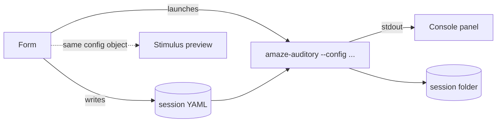
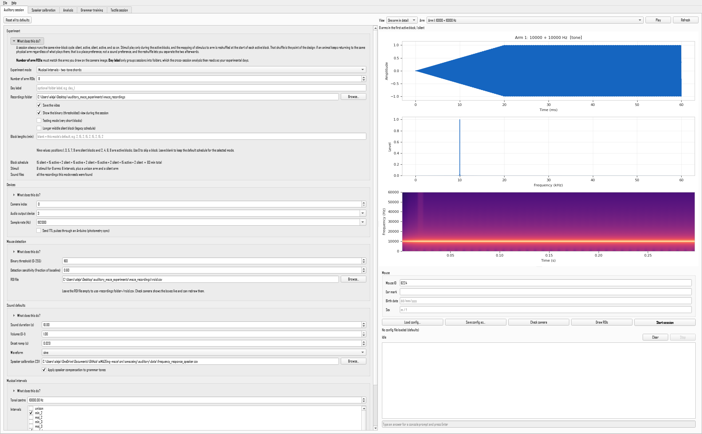
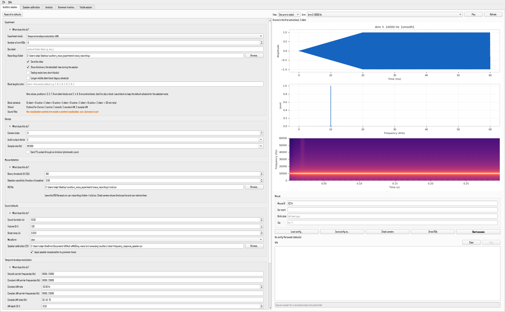
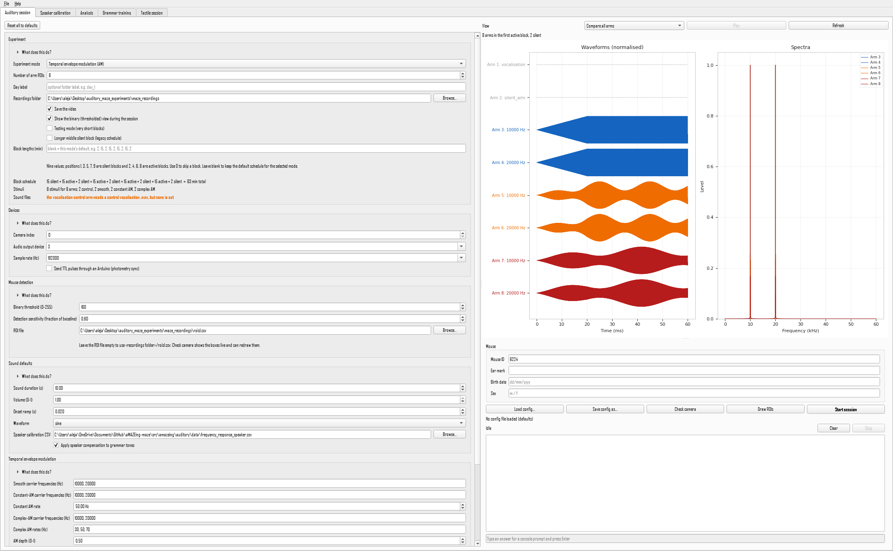
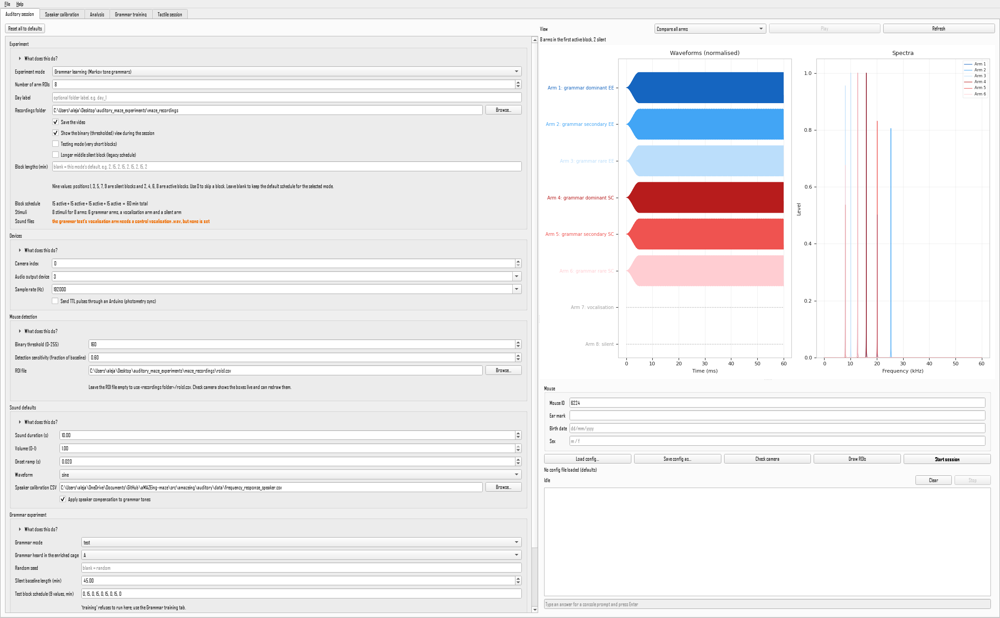
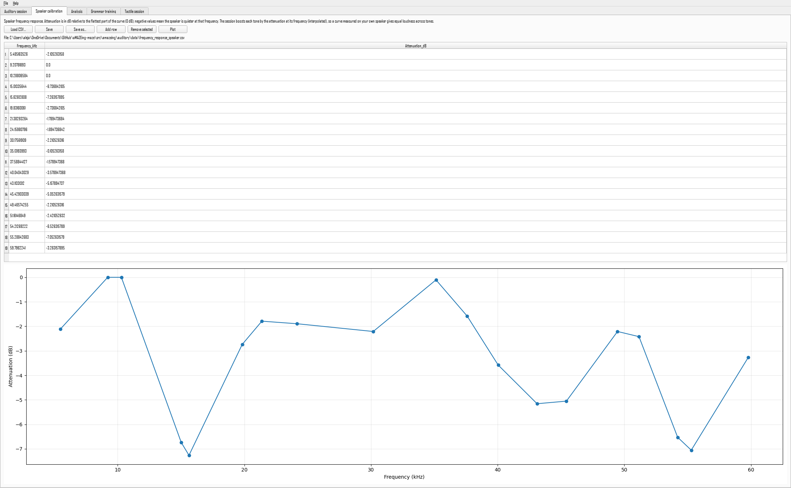
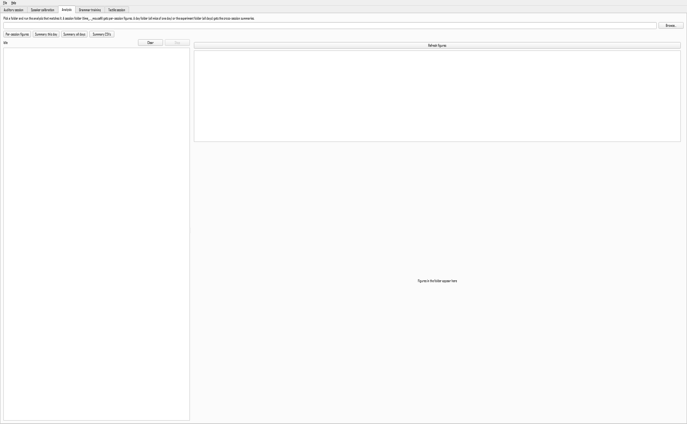

# The application

`amaze-app` is a window over the same command-line tools described everywhere else in this documentation. It writes a configuration file and launches the tools as separate processes, showing their output in a console panel. Nothing it does is unavailable from a terminal, and every session it starts is reproducible from the file it writes.

## The tabs

| Tab | Purpose |
|---|---|
| **Auditory session** | Design and run an auditory session |
| **Speaker calibration** | Edit the frequency response curve used to equalise the stimuli |
| **Analysis** | Generate figures and tables from recorded sessions |
| **Grammar training** | Continuous grammar playback for home-cage training days |
| **Tactile session** | Launch the tactile paradigm |

## The session tab

The form on the left holds every setting. Sections that do not apply are hidden rather than disabled: choosing an experiment mode shows that mode's parameters and hides the others, and the Arduino port appears only when TTL output is switched on. Nothing visible on the form is a setting that would be ignored.

Three things make the form harder to get wrong:

- **The block schedule line** under Experiment recomputes as you type and states the result in words, so the nine numbers are never the only description of what will happen.
- **The scroll wheel does nothing** to a control that does not have keyboard focus, so scrolling past the form cannot silently change a value.
- **Reset all to defaults** returns every field to the shipped value.

Each section carries a collapsed **What does this do?** explaining what it controls and the practical consequence of getting it wrong.

## Seeing the stimuli

The panel on the right shows what will play. The sounds are produced by the real trial factory at a shortened duration, so this is not an approximation of the stimulus but the stimulus itself.

=== "One arm in detail"

    Waveform with its amplitude envelope, spectrum and spectrogram. **Play** auditions the arm through the configured device.

    

=== "Compare all arms"

    Every arm's waveform and spectrum together, which is the quickest way to see how a stimulus set varies across the maze and to catch two arms that are accidentally the same.

    

Colours mean the same thing here as in your results figures. Grammar arms use the blues and reds of the enriched and standard environments, vocalisations are green and silence grey, exactly as in the session figures.

## Checking the camera and the detection

**Check camera** opens a live view before anything is recorded. It measures the empty-maze baselines exactly as a session does, then shows the picture with the arm boxes drawn on it, the binary picture detection works from, and a bar for every arm showing how far its current reading sits from the line that counts as occupied.

**Binary threshold** and **detection sensitivity** are sliders in that window, so the effect of moving them is visible in the same instant. Walk a hand down the maze and watch the boxes turn red. A bar that sits close to the line turns amber: that arm will trip on a shadow, and it is the one to fix.

| Key | Does |
|---|---|
| ++d++ | Redraw the arm boxes, then return to the live view |
| ++c++ | Measure the empty-maze baselines again |
| ++s++ | Write the threshold and sensitivity you have settled on back to the config |
| ++q++ | Close |

After ++s++, closing the window brings both values back into the form, and the line under the buttons says what came back. Save the config to keep them.

This is deliberately usable before the rest of the form is finished: the camera check does not look at the stimuli or the sound files, because setting the camera up is the first thing you do and often the stimuli are not decided yet.

!!! tip "The numbers are not fractions of one"
    An empty arm normally reads well above `1.00`. The baseline is a sum over the grey picture and the reading is a sum over the black and white one, so they are on different scales. What matters is the gap: put the sensitivity line between where an arm sits empty and where it sits with the animal in it.

## Running a session

Enter a **Mouse ID**, and optionally the metadata fields, then press **Start session**. The application writes the configuration to `<recordings folder>/session_configs/` with a timestamp, and launches the session with that file. The console panel shows progress; the camera windows open as usual.

If a tool asks a question on the console, type the answer in the line under the console and press ++enter++.

Press **Stop** to end a running process. In the camera window, ++q++ or ++esc++ ends the session and still writes the data and the figures.

## The calibration tab

A table of frequency against attenuation, with a plot. See [speaker calibration](speaker-calibration.md) for what to put in it and why it matters. Saving here points the session at the file you saved.

## The analysis tab

Choose a folder and run the analysis that matches it: a single session folder gets per-session figures, a day folder or the whole experiment folder gets the cross-session summaries. Figures in the folder are listed and previewed.
