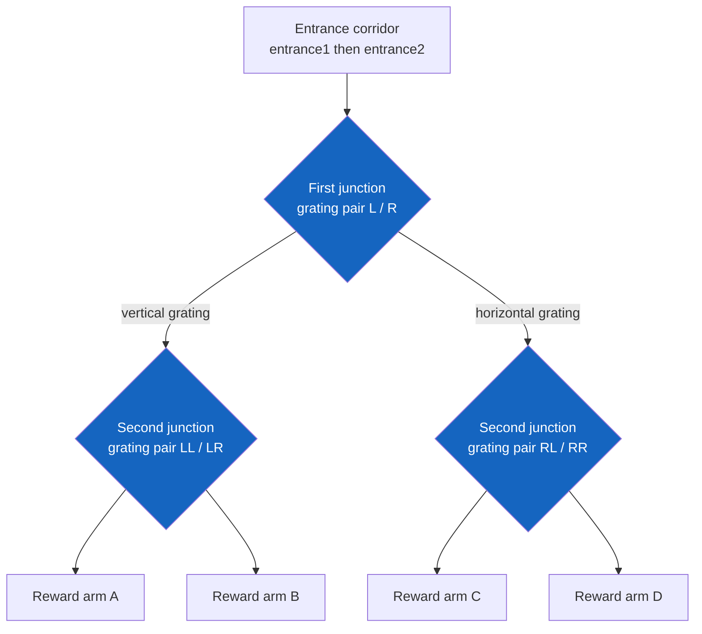
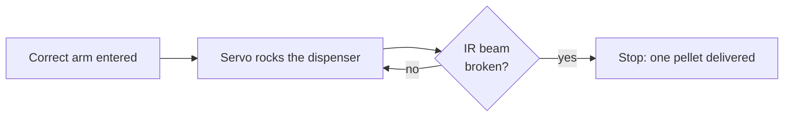
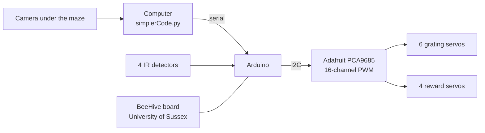

# The tactile paradigm

The tactile maze asks a different question from the auditory one. Instead of measuring where an animal chooses to spend time, it sets a task with a right answer and measures whether the animal learns it. The cue is texture, read by the whiskers, and the reward is a food pellet delivered automatically.

## The task

The maze is a two-level binary decision tree. The animal enters from the home cage through a connecting corridor, meets a junction, chooses left or right, meets a second junction, chooses again, and arrives at one of four reward arms.

At each junction it is met by **a pair of 3D-printed gratings facing each other**, one on the left wall and one on the right, each turned by its own servo. **The vertical grating marks the correct way.** The other is horizontal.



There are **three pairs of gratings**, one before every decision point: the first junction, and each of the two second-level junctions.

### A worked example

Say this trial's reward is in the bottom right arm.

1. **At the first junction**, the left grating is set horizontal and the right grating vertical. Following the vertical grating takes the animal right.
2. **At the second junction**, again the left grating is horizontal and the right vertical. Following it takes the animal right again.
3. **Arriving in the reward arm**, the camera detects the animal in that arm's region of interest and a pellet is released.

The gratings are returned to neutral at the start of every trial and then set for that trial's reward location, so the cue is generated fresh each time rather than left standing.

### What counts as a trial

A trial begins when the animal passes through the connecting corridor into the maze, detected as `entrance1` followed by `entrance2`, and ends when it passes back the other way. Everything in between belongs to that trial: the choices, the time, and the trajectory.

The outcome is recorded as one of:

| Outcome | Meaning |
|---|---|
| **hit** | Reached the rewarded arm without entering a wrong one first |
| **incorrect** | Entered a wrong reward arm first |
| **miss** | Left the maze without entering any reward arm |

## The automated reward port

The reward port is the part of the rig the lab is most pleased with, and it solves a problem every pellet dispenser has: knowing whether a pellet actually came out.

A servo rocks the dispenser between two positions. An **infrared beam across the chute** watches for a pellet falling through. The servo keeps rocking until the beam is broken, then stops.



The loop is closed rather than open. A dispenser that simply turns by a fixed amount will sometimes deliver nothing, because pellets jam, and sometimes deliver two. Here the mechanism cannot stop until exactly one pellet has physically passed the beam, so a trial recorded as rewarded really was rewarded. That matters: an animal that reaches the right arm and receives nothing learns the wrong lesson, and the record would not show it.

There is one port per reward arm, each with its own servo and its own infrared detector.

## Training stages

Animals do not start on the full task. `reward_sequences.csv` defines the stages, and each row gives one reward location's share of the trials and the probability it is rewarded.

| Column | Meaning |
|---|---|
| `sessionID` | Stage name, `Stage 1` to `Stage 4` |
| `rewloc` | Reward arm, `A` to `D` |
| `portprob` | Fraction of the session's trials using this arm |
| `rewprob` | Probability that a correct trial at this arm is rewarded |
| `wrongallowed` | Whether entering a wrong arm first still allows the reward |

Trials are drawn from this table and shuffled, with a pass that breaks up consecutive repeats of the same arm so the animal cannot succeed by simply staying put.

In the earliest stage the gratings are set to a small fixed angle rather than the full cue, which habituates the animal to their presence and movement before the texture means anything.

## Hardware



**Servo channels on the PCA9685**, as defined in the firmware:

| Channel | Grating | Position |
|---:|---|---|
| 0 | `L` | First junction, left |
| 1 | `R` | First junction, right |
| 4 | `LL` | Left second junction, left |
| 2 | `LR` | Left second junction, right |
| 3 | `RL` | Right second junction, left |
| 5 | `RR` | Right second junction, right |

Channels 12 to 15 carry a further set (`LLL`, `LRR`, `RLL`, `RRR`) for a three-level maze. The firmware supports them; the two-level configuration does not use them.

**Reward ports**, each pairing a servo with an infrared detector:

| Arm | Servo channel | IR sensor pin |
|---:|---:|---:|
| A | 8 | 2 |
| B | 9 | 15 |
| C | 7 | 17 |
| D | 6 | 16 |

The grating servos are Pololu FS90 micro servos. Pulse limits for both servo types are set at the top of the firmware sketch and will need adjusting if you fit different ones.

!!! note "The BeeHive board"
    The rig uses a BeeHive board developed at the University of Sussex alongside the Arduino and the PCA9685. Its documentation is not yet part of this repository; a link and a wiring description should be added here.

## Configuration files

Two CSVs sit beside `simplerCode.py` and are read at startup.

**`grating_maps.csv`** maps each reward location to the grating positions that cue the route to it. The index is the reward arm; every other column is one grating servo, holding the command sent to it.

```csv
rewlocation,motor L,motor R,motor LL,motor LR,motor RL,motor RR
A,L 90,R 0,LL 90,LR 0,RL 0,RR 0
B,L 90,R 0,LL 0,LR 90,RL 0,RR 0
C,L 0,R 90,LL 0,LR 0,RL 90,RR 0
D,L 0,R 90,LL 0,LR 0,RL 0,RR 90
```

Read the first row as: to cue arm A, turn the first-junction left grating to 90 and the right one to 0, then the left second-junction gratings likewise. Angles are in a 0 to 120 range that the firmware maps onto the servo's pulse limits.

**`reward_sequences.csv`** defines the training stages, described above.

!!! warning "Check these against your rig"
    The files shipped in the repository are **templates reconstructed from what the code reads**, not a copy of the values used in the original experiments. Confirm the angles that give vertical and horizontal on your gratings, and the stage probabilities you intend, before collecting data.

## Running a session

From the application, open the **Tactile session** tab and press **Start tactile session**. The script asks for the animal ID, session ID and experiment phase on the console; type the answers into the line under the output.

From a terminal:

```bash
amaze-tactile
```

Settings that are still flags at the top of `simplerCode.py`:

| Flag | Meaning |
|---|---|
| `serialOn` | Set `False` to run without the Arduino connected |
| `testing` | Short run with fixed paths, for checking the code |
| `recordVideo` | Whether to save the video |
| `drawRois` | Redraw the regions of interest |
| `videoInput` | Camera index, or a path to a recorded video |

The regions of interest are `entrance1`, `entrance2` and `rewA` to `rewD`, drawn on first run and saved as `rois1.csv` next to the recordings.

!!! note "Camera position differs from the auditory maze"
    The tactile maze is filmed **from below** through an infrared-transmitting floor, so the animal appears as a silhouette against a bright background. The auditory maze is filmed from above.

## What a session saves

| File | Contents |
|---|---|
| `session_data_<timestamp>.csv` | One row per trial, written as the session runs |
| `data_from_session_<timestamp>.csv` | The same table written once at the end |
| `trials_before_session.csv` | The planned trial list |
| `<animal>_<timestamp>.csv` | Animal metadata |
| `<animal>_<timestamp>.mp4` | The video |

Per-trial columns include the reward location, the outcome flags, the time spent in each region, the first reward arm entered, the time from entry to that arm and from there to leaving, and the start and end video frames for the trial.

Those frame numbers matter for the analysis: they let the video be cut into per-trial segments for pose estimation without re-detecting anything.

```bash
amaze-tactile-segments
```

## Analysis

See the [tactile analysis pipeline](../analysis/tactile.md) for choice accuracy across sessions, trajectory metrics and the statistical models, and the [pose estimation pipeline](../analysis/pose.md) for turning the video into per-frame keypoints.

## Its current state

The tactile script has not yet been rebuilt on the shared modules the auditory paradigm uses. It is the original script, run unchanged, with its settings as flags at the top of the file rather than in a session configuration. That is deliberate: it is the code that produced the data, and rewriting it would mean revalidating it against the animals. Bringing it onto the shared configuration system is planned.
