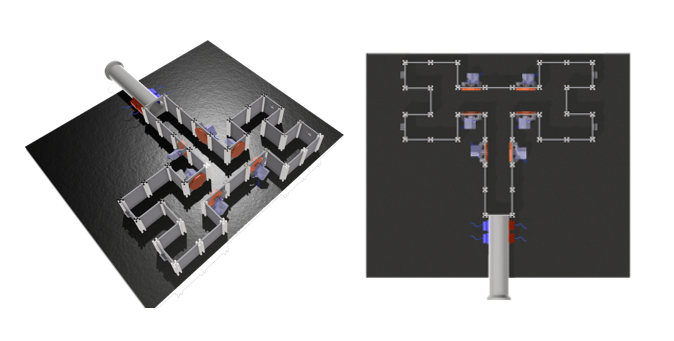
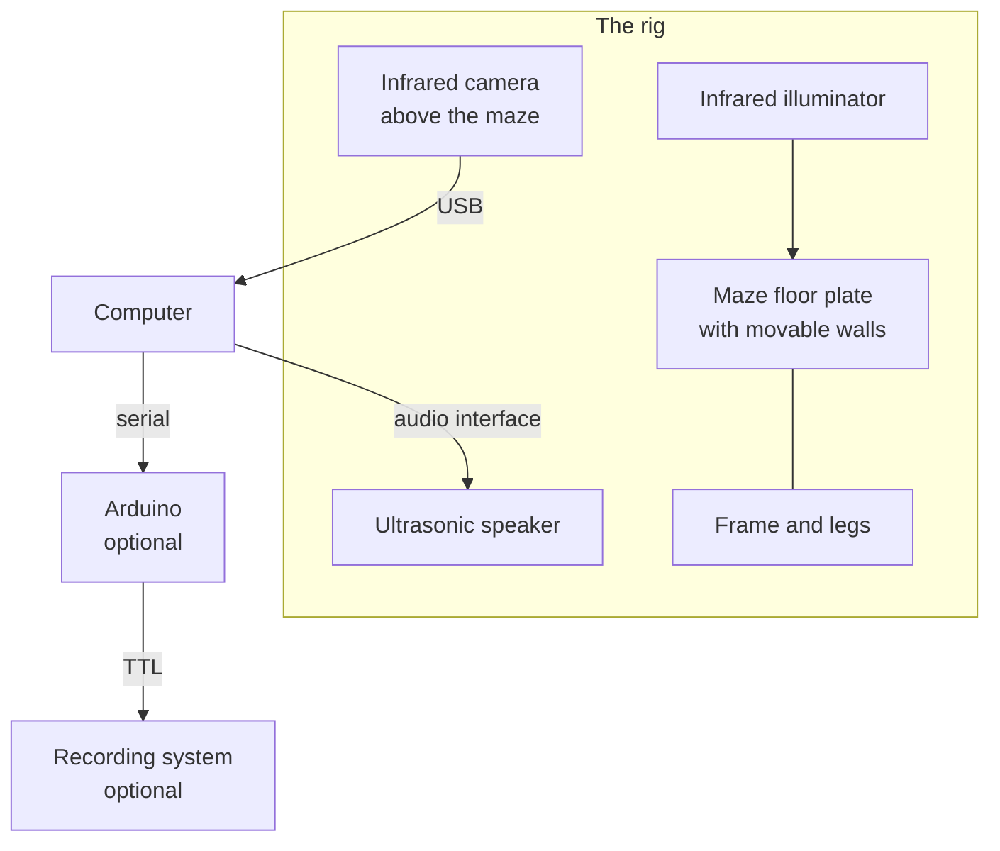

# Tutorial: build and set up the rig

How to go from parts to a working maze. The design is deliberately reconfigurable: the floor is a grid of threaded holes and the walls slot into aluminium posts, so the same rig becomes a four-arm radial maze, an eight-arm one, or a binary decision tree by moving walls rather than building something new.



## What you are building



The camera looks **down** at the maze in the auditory configuration and **up** from below in the tactile configuration, where the floor is infrared-transmitting so the animal is a silhouette against a bright background.

## Parts

### Structure

| Part | Specification | Notes |
|---|---|---|
| Floor plate | 700 x 700 x 10 mm, black, infrared transmitting | Drilled with a regular grid of M3 holes so wall posts can go anywhere |
| Wall panels | 50 x 50 x 3 mm acrylic, black | About 50 with spares |
| Posts | MakerBeam XL, 15 x 15 mm, 50 mm long, black anodised | Panels slide into the T-slots |
| Bolts | M3 x 16 mm with nuts, one per post | Nuts go under the floor plate |
| Legs | 50.8 x 50.8 x 1.6 mm box section, 880 mm | Four, with plastic joints and feet |
| Horizontal bars | 660 mm | Four, around the outside |
| Feet | M6 bolts and nuts | One per corner, for levelling |

Full measurements, including the dimensions taken from the Rosenberg maze this design started from, are on the [dimensions](dimensions.md) page. Suppliers the lab used are on the [materials](materials.md) page.

### Electronics

| Part | Notes |
|---|---|
| Infrared camera | Must have the infrared filter removed. The lab used an ELP USB camera |
| Infrared illuminator | Even coverage matters more than brightness |
| Ultrasonic speaker | With a published frequency response, or the means to measure one |
| Audio interface | 192 kHz capable |
| Arduino Uno or Nano | Only for TTL synchronisation |
| Adafruit PCA9685 | Only for the tactile paradigm's servos |

### Printed parts

All in `hardware/3dmodels/` as FreeCAD sources and STLs: the camera housing, the electronics enclosure, the movable wall mechanism, the transfer tunnel and the reward chute.

## Assembly

### 1. Floor and frame

Bolt the legs to the floor plate with the M6 bolts and fit the feet. Assemble the box-section frame around the outside with its plastic joints. The lab attached the frame with velcro so it can be lifted off.

**Level the plate before going further.** An animal on a sloping floor has a side bias, and you will spend a long time looking for that in the data.

### 2. Walls

Bolt posts into the grid at the positions your configuration needs, then slide the acrylic panels into the T-slots between them. A four-arm maze needs roughly 50 panels and 50 posts.

Configure a simple layout first and run an animal before building something elaborate.

### 3. Camera

Mount the camera centrally above the maze, high enough to see the whole floor plus both entrance zones. The camera housing in `hardware/3dmodels/camera_holder/` is designed for this.

Two things to get right:

- **The whole maze in frame, with margin.** You will draw arm boxes on this picture, and an arm cut off at the edge cannot be monitored.
- **Nothing moves afterwards.** The arm boxes are saved in pixel coordinates. Bumping the camera means redrawing them, and a session recorded with stale boxes is lost.

### 4. Lighting

Place the illuminator so the floor is evenly lit. Detection compares each arm against its own empty brightness, so uneven lighting is tolerable but drifting lighting is not. Avoid daylight reaching the maze.

### 5. Speaker

Position it so every arm receives a comparable level. A speaker at one end makes near arms louder, which the calibration curve cannot fix because it corrects frequency, not position.

Measure the level at several arm positions with a sound level meter and adjust placement until they agree.

### 6. Arduino, if using TTL

Upload `firmware/ttl_bnc/TTL_bnc.ino`, connect pin 8 to the digital input of your recording system, and note the COM port. See [firmware](firmware.md).

## Configuring the tactile maze

The auditory configuration above is the simpler one. The tactile maze adds
gratings, reward ports and their electronics.

### Walls and gratings

Build the two-level binary decision tree: an entrance corridor, a first
junction, then two second junctions, each leading to a pair of reward arms.

Fit **three pairs of gratings**, one pair before each junction, mounted facing
each other across the corridor so the animal whisks against one on each side as
it approaches the choice. The printed parts are in
`hardware/3dmodels/archive/gratings/`, and the movable wall mechanism that
carries them is in `hardware/3dmodels/moveable_wall/`.

Each grating has its own servo. Wire them to the PCA9685 on the channels the
firmware expects, listed on the [firmware](firmware.md) page, or change the
`#define` lines to match your wiring.

**Check the angles before anything else.** Send a command by hand and watch:

```
grtL 0
grtL 90
```

Note which angle gives vertical and which gives horizontal, then put those
numbers in `grating_maps.csv`. The values shipped in the repository are a
template, not a measurement of your rig.

### Reward ports

One per reward arm, each combining the servo-driven dispenser from
`hardware/3dmodels/reward delivery/` with an infrared emitter and detector
placed across the chute so a falling pellet breaks the beam.

Alignment matters more than anything else here. If the beam never breaks, the
servo rocks forever; if it reads broken with nothing there, every trial reports
a reward that was not given. Run `firmware/arduino/testIR/testIR.ino`, watch the
four readings, and drop pellets through by hand until each one registers
reliably.

### Camera, from below

The tactile maze is filmed **through the floor**, which is infrared
transmitting, so the animal appears as a silhouette against a bright background.
Mount the camera below the plate, looking up, and the illuminator above.

### Electronics

Arduino, connected by serial to the computer, driving the PCA9685 over I2C,
which drives the ten servos. The four infrared detectors go to the Arduino's
digital pins. A BeeHive board developed at the University of Sussex is used
alongside these.

Upload `firmware/arduino/servo_control/servo_control.ino`, and use
`firmware/arduino/i2c_scanner/` first if the PCA9685 does not respond.

## First run

### Check the picture

Start the application, set the camera index in **Devices**, and press **Draw ROIs**. You should see the maze. Wrong room means wrong index.

### Draw the arms

Draw `entrance1` and `entrance2` across the connecting corridor in that order, since entrance1 then entrance2 means entering and the reverse means leaving. Then one box per arm, over the region the animal's body occupies rather than the whole arm.

### Tune the detection

Run a short session with **Testing mode** ticked and watch the **Binary Debug View**: the floor should be white and anything on it black. If the floor is grey and patchy, adjust the illumination or the binary threshold.

Move a dark object into an arm. Its box should turn red promptly and turn blue again when you remove it. Adjust **Detection sensitivity** if entries are missed or spurious.

### Calibrate the speaker

Before any real data. See [speaker calibration](../guide/speaker-calibration.md). Without it, louder frequencies masquerade as preferred ones.

## A checklist before the first animal

- [ ] Floor level
- [ ] Camera sees the whole maze and both entrance zones, and is fixed
- [ ] Binary view shows a clean silhouette
- [ ] Arm boxes drawn and saved
- [ ] Entries and exits logged correctly for a hand-moved object
- [ ] Sound level comparable at every arm
- [ ] Speaker calibration curve loaded
- [ ] A test session runs end to end and writes figures

### Additionally, for the tactile maze

- [ ] Every grating reaches both positions, and you know which angle is vertical
- [ ] `grating_maps.csv` holds your measured angles, not the template values
- [ ] All four infrared beams register a hand-dropped pellet reliably
- [ ] Each reward port delivers exactly one pellet and then stops
- [ ] `reward_sequences.csv` describes the training stages you intend
- [ ] The camera below the plate sees the whole maze
