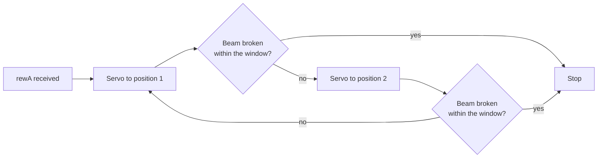

# Firmware

Sketches for the microcontrollers, in the `firmware/` folder of the repository.

## Tactile maze: gratings and reward ports

`firmware/arduino/servo_control/servo_control.ino` runs the whole tactile rig. It
listens for text commands on the serial port and drives ten servos through an
Adafruit PCA9685 sixteen-channel PWM controller, plus four infrared detectors.

It needs two Arduino libraries:

- [Adafruit PWM Servo Driver](https://github.com/adafruit/Adafruit-PWM-Servo-Driver-Library)
- [Arduino SerialCommand](https://github.com/kroimon/Arduino-SerialCommand)

### Command protocol

| Command | Effect |
|---|---|
| `grt<name> <angle>` | Turn grating `<name>` to `<angle>`, for example `grtLL 90` |
| `rew<arm>` | Run the reward routine for arm `A` to `D`, for example `rewA` |

Angles are given in a 0 to 120 range, which the sketch maps onto the servo's
pulse limits. The session sets every grating to 0 at the start of a trial, then
sends the positions for that trial's reward location.

### Grating channels

Three pairs, one before each decision point of the two-level tree.

| Channel | Name | Position |
|---:|---|---|
| 0 | `L` | First junction, left |
| 1 | `R` | First junction, right |
| 4 | `LL` | Left second junction, left |
| 2 | `LR` | Left second junction, right |
| 3 | `RL` | Right second junction, left |
| 5 | `RR` | Right second junction, right |

Channels 12 to 15 carry `LLL`, `LRR`, `RLL` and `RRR` for a three-level maze.
The firmware accepts them; the two-level configuration does not use them.

The grating servos are Pololu FS90 micro servos, and the pulse limits at the top
of the sketch (`GRATSERVOMIN`, `GRATSERVOMAX`) are set for that model. Fit a
different servo and those need adjusting.

### Reward ports

Each arm pairs a servo with an infrared detector across the pellet chute.

| Arm | Servo channel | IR sensor pin |
|---:|---:|---:|
| A | 8 | 2 |
| B | 9 | 15 |
| C | 7 | 17 |
| D | 6 | 16 |

The routine is closed-loop. The servo rocks the dispenser between two positions
while the sketch watches the infrared input, and it keeps rocking until the beam
reads broken, which means a pellet has physically fallen through. Then it stops.

This is why a trial recorded as rewarded really was rewarded. A dispenser that
turns by a fixed amount sometimes delivers nothing, because pellets jam, and the
record would not show it. An animal that reaches the correct arm and receives
nothing learns the wrong lesson.

`firmware/arduino/testIR/testIR.ino` prints all four detectors continuously, for
checking the beams and their alignment. `firmware/arduino/i2c_scanner/` confirms
the PCA9685 is visible on the I2C bus.

## Auditory maze: TTL synchronisation

`firmware/ttl_bnc/TTL_bnc.ino` listens on the serial port and drives one pin:
`H` takes it high when a sound starts, `L` takes it low when the sound ends or
the animal leaves the arm. Wire that pin to the digital input of the system you
want to align to, such as a fibre photometry rig.

Only needed when something else must be aligned to the sound. Ordinary auditory
sessions do not use it.

## MicroPython

`firmware/micropython/` holds the Adafruit PCA9685 driver for running the servos
from a MicroPython board instead of an Arduino.

## The BeeHive board

The tactile rig uses a BeeHive board developed at the University of Sussex
alongside the Arduino and the PCA9685. Its documentation is not yet part of this
repository; a description and a link should be added here.
