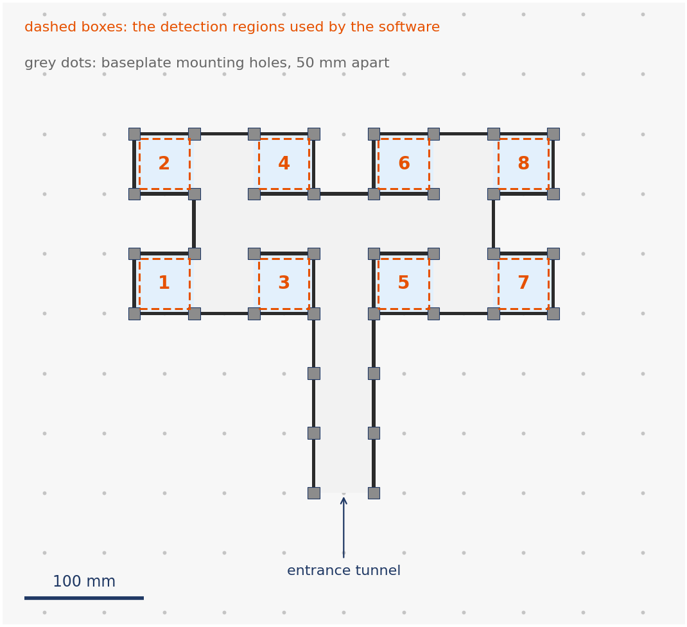
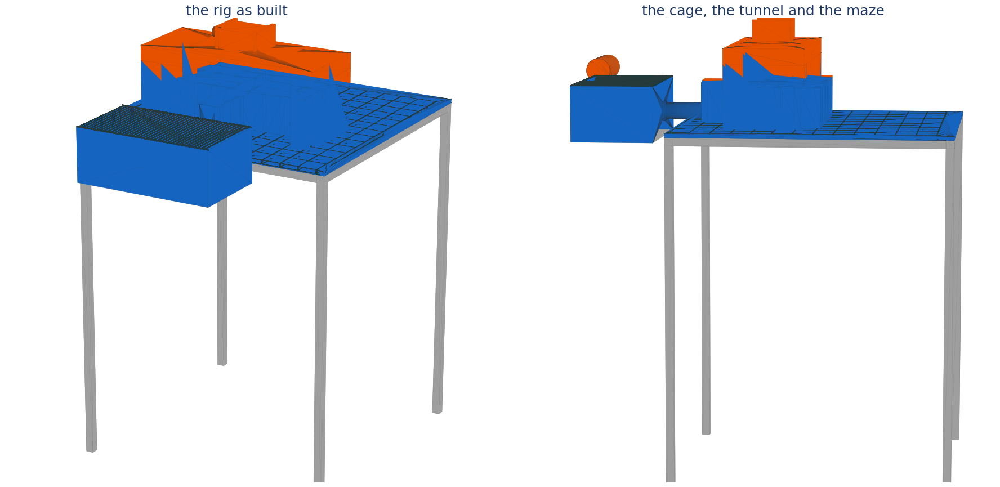

# The eight-arm maze

The configuration used for the auditory preference experiments: a corridor
running the width of the maze with four arms opening off each side, and an
entrance tunnel at the midpoint of one long side. The animal enters through the
tunnel from its transport cage, which docks at the open end.



Walls are acrylic panels held between MakerBeam posts on the drilled floor
plate, so the geometry is a grid: posts sit at 50 mm spacing and every panel
runs from one post to the next. The dashed boxes are the detection regions the
software uses, numbered as it numbers the arms.

## The layout is a file, not a drawing

The plan above and the walls of the solid model both come from one file,
`hardware/3dmodels/eight_arm_maze/maze_layout.json`, which records which squares
of the post grid are floor, which edges carry a panel and where the boundary is
open. Nothing is traced, so nothing is distorted, and the drawing and the model
cannot drift apart about the maze.

To change the maze, redraw the layout rather than editing either output. The
editor shows the post grid and lets you click the squares the animal can walk
on and the edges that carry a panel.

## The solid model

`hardware/3dmodels/eight_arm_maze/eight_arm_maze_modified.FCStd` is the model of
the rig. Alongside the maze it holds the table frame, the printed ceiling, the
transfer tunnel, the speaker with its grille, end caps and SpeakON connector,
the foam structure and board that carry it, and the home cage with its wire lid
and water bottle. The whole assembly measures 700 x 960 x 1151 mm, from the feet
of the legs to the top of the speaker. Everything except the walls and posts was
added by hand, because a grid of squares cannot describe it.



Grey is the table frame, blue the floor plate, maze and cage, orange the speaker
and the structure carrying it. The animal walks from the cage through the tunnel
into the maze, all of it in darkness, with the camera and the infrared
illuminator below the plate. The views are drawn from a mesh exported from the
model, so they are the model rather than an impression of it.

## Regenerating the walls and posts

Only needed if the maze layout changes.
`hardware/3dmodels/eight_arm_maze/build_maze_model.py` turns the layout into
panels, posts and a floor plate, and writes a FreeCAD document along with STEP
and STL versions, under a different name so it cannot overwrite the model above.
Run it inside FreeCAD, from `Macro > Macros...`, or headless:

```
FreeCADCmd build_maze_model.py
```

Without FreeCAD it still reports what it would build, which is the quickest way
to check a dimension or a part count:

```
python build_maze_model.py
```

```
layout    maze_layout.json: 21 floor squares, 37 panels, 8 detection regions
maze      350 x 300 mm, centred on a 700 x 700 mm plate
panels    100 x 50 x 3 mm acrylic (height x width x thickness)
posts     15 x 15 mm MakerBeam XL, 100 mm long
parts
     1  Baseplate
    37  Panels
    38  Posts
```

This configuration uses the taller 100 mm panels, on 100 mm posts. The four-arm
tactile maze uses the 50 mm panels on 50 mm posts. The other part dimensions are
on the [dimensions](dimensions.md) page.
