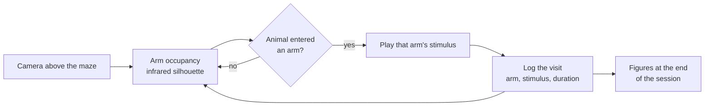
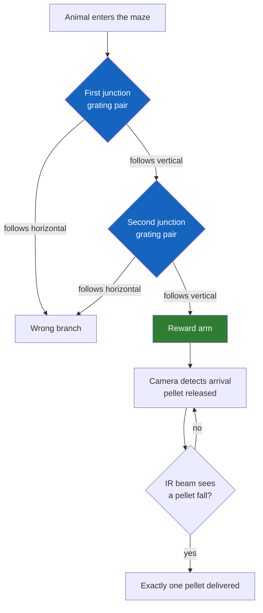
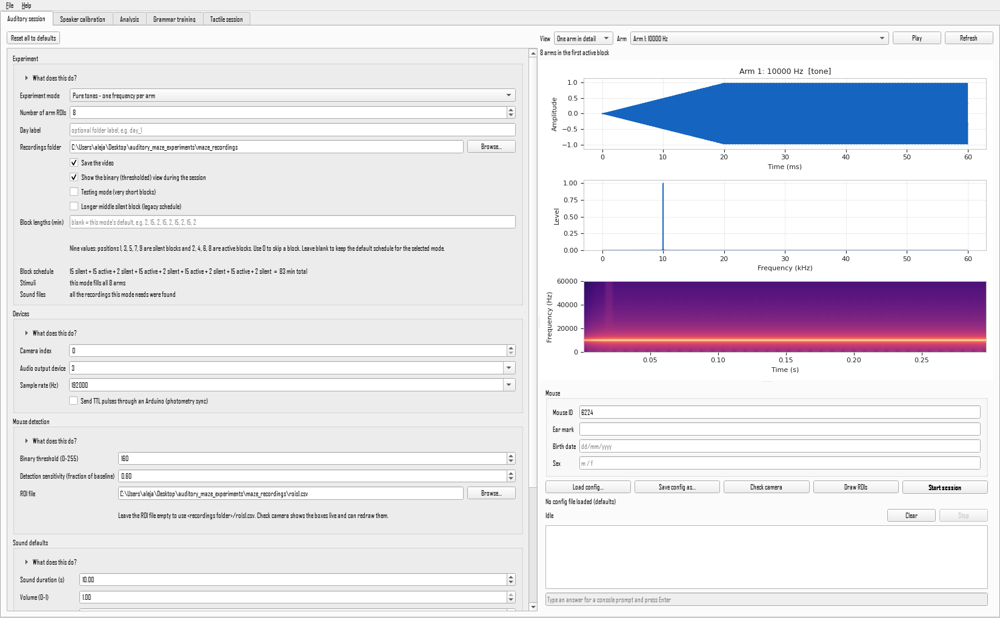

# The aMAZEing maze

**A modular, automated, sensory-engaging open-source platform for studying how sensory cues shape active exploration in rodents.**

The maze is a reconfigurable arena filmed under infrared light, built on a drilled floor plate so the walls move and the same rig becomes a different maze. Software tracks which arm the animal is in and drives the stimuli in real time.

It runs as two paradigms, equally developed, sharing the hardware, the tracking and the analysis tooling.

<div class="grid cards" markdown>

-   :material-rocket-launch: **New here**

    ---

    Install the software and run a short auditory session end to end.

    [Run your first session](getting-started/first-session.md)

-   :material-gesture-tap-button: **The tactile task**

    ---

    Gratings, automated reward ports, training stages and the electronics.

    [The tactile paradigm](guide/tactile.md)

-   :material-chart-line: **You have data**

    ---

    Turn recorded sessions into figures and statistics.

    [Analyse a set of sessions](analysis/tutorial.md)

-   :material-hammer-wrench: **Building a rig**

    ---

    Parts, assembly, wiring and first calibration.

    [Build and set up the rig](hardware/build.md)

</div>

## The auditory maze

Sound triggered by arm entry. Nothing is rewarded and nothing is required: the animal explores, and **where it chooses to spend its time is the measurement**.



The stimuli can be pure tones, musical intervals, amplitude modulation, tone sequences, artificial grammars or recorded vocalisations. A session runs a nine-block cycle of alternating silent and active periods, and the stimulus-to-arm mapping is reshuffled at the start of each active block. That reshuffle separates a preference for a **sound** from a preference for a **place**.

[Experiment modes](guide/experiment-modes.md) covers the paradigms and their parameters.

## The tactile maze

A two-level binary decision tree with a right answer. The cue is texture, read by the whiskers, and the reward is a food pellet delivered automatically.

**Three pairs of servo-driven 3D-printed gratings**, one pair before every decision point, face each other across the corridor. **The vertical grating marks the correct way**; the other is horizontal. Follow vertical at both junctions and you reach the rewarded arm.



The reward port is closed-loop: a servo rocks the dispenser while an infrared beam watches the chute, and stops the moment a pellet is detected falling through. A trial recorded as rewarded really was rewarded, rather than the mechanism turning by a fixed amount and hoping.

A trial runs from the animal entering the maze to leaving it, and is scored as a hit, an incorrect choice, or a miss. Training proceeds through four stages of increasing difficulty.

[The tactile paradigm](guide/tactile.md) has the task, the hardware and the configuration files.

## Two ways to drive it

The graphical application and the command line run the same code. The application writes a configuration file and then launches exactly the commands a terminal user would type, so a session started either way is identical and reproducible from that file.

```bash
pip install -e ".[gui]"
amaze-app
```



## Citing and licence

Released under the GPL-3.0-or-later licence. The code used for the original behavioural experiments is tagged `v1.0-thesis` in the repository.

**Contributors:** Miguel Maravall, Oluwaseyi Jesusanmi, Andre Maia Chagas, Yuri Elias Rodrigues, Maja Nowak, Marcus Burnell-Spector, Shahd Al Balushi, Isabel Maranhao, Alejandra Carriero, Moira Eley.
