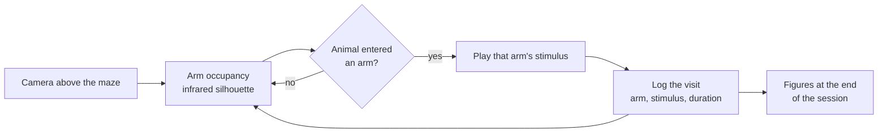

# The aMAZEing maze

**A modular, automated, sensory-engaging open-source platform for studying how sensory cues shape active exploration in rodents.**

The maze is a reconfigurable arena filmed from above under infrared light. Software watches which arm the animal is in and, the moment it enters, plays the stimulus assigned to that arm. Nothing is rewarded and nothing is required: the animal explores, and where it chooses to spend its time is the measurement.

<div class="grid cards" markdown>

-   :material-rocket-launch: **New here**

    ---

    Install the software and run a short session end to end.

    [Run your first session](getting-started/first-session.md)

-   :material-tune-variant: **Designing an experiment**

    ---

    Choose a paradigm, map stimuli to arms, and see the sounds before you play them.

    [Experiment modes](guide/experiment-modes.md)

-   :material-chart-line: **You have data**

    ---

    Turn recorded sessions into figures and statistics.

    [Analyse a set of sessions](analysis/tutorial.md)

-   :material-hammer-wrench: **Building a rig**

    ---

    Parts, assembly, wiring and first calibration.

    [Build and set up the rig](hardware/build.md)

</div>

## Two paradigms

| Paradigm | What it presents | What it measures |
|---|---|---|
| **Auditory maze** | Sounds triggered by arm entry: pure tones, musical intervals, amplitude modulation, tone sequences, artificial grammars, recorded vocalisations | Where the animal chooses to spend time, and therefore which sounds it approaches or avoids |
| **Tactile maze** | Servo-driven gratings in a two-level binary decision tree, with food reward | Choice accuracy and trajectory as the animal learns which texture predicts reward |

## How a session works



Every session runs a nine-block cycle of alternating silent and active periods, and the stimulus-to-arm mapping is reshuffled at the start of each active block. That reshuffle is what separates a preference for a **sound** from a preference for a **place**.

## Two ways to drive it

The graphical application and the command line run the same code. The application writes a configuration file and then launches exactly the commands a terminal user would type, so a session started either way is identical and reproducible from that file.

```bash
pip install -e ".[gui]"
amaze-app
```


## Citing and licence

Released under the GPL-3.0-or-later licence. The code used for the original behavioural experiments is tagged `v1.0-thesis` in the repository.

**Contributors:** Miguel Maravall, Oluwaseyi Jesusanmi, Andre Maia Chagas, Yuri Elias Rodrigues, Maja Nowak, Marcus Burnell-Spector, Shahd Al Balushi, Isabel Maranhao, Alejandra Carriero, Moira Eley.
